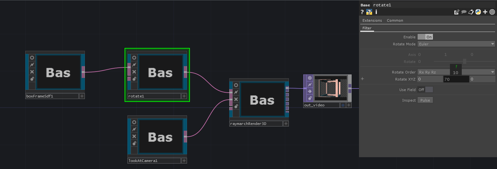

# RayTK

RayTK is a library of TouchDesigner components that construct raymarching shaders (and other types of shaders) with networks of COMPs using the TouchDesigner network editor.

RayTK consists of a set of operator (ROP) components, and a set of tools for working with them.

## Getting Started

### Download the Library

The first step to using RayTK is to download the latest tox file, from the [repository](https://github.com/t3kt/raytk/releases).

Note that there are many of files in the repository itself, but these are only needed for development purposes. If you only want to *use* the library rather than *modify* it, use the release tox file.

### Load the Library

Drag the tox file into your project. It's a good idea to put it in the *root* network (`/` rather than `/project1`), but not strictly necessary.

### Creating a Network

To create your first ROP, use the keyboard shortcut `alt + r` to open up the editor tools popup. It will show a list of available ROPs, organized into categories. You can search by typing a name. This popup is like the main TouchDesigner "OP Create Dialog" (using `tab`), but it shows the available ROPs rather than the standard TouchDesigner OPs.

1. Choose a `boxFrameSdf`, and a new COMP will be created in the network editor.
1. Create a `raymarchRender3d` and connect its input to the output of your `boxFrameSdf`.
1. Create a `lookAtCamera` and connect it to the "camera" input on the `raymarchRender3d`.
1. Connect a `Null TOP` to the first output of `raymarchRender3d`.
1. Play around with the parameters of the `boxFrameSdf`.

You've just created your first RayTK network!

The `boxFrameSdf` is an `SDF` (signed distance function) operator, which is how you define geometry. It's equivalent to `SOP`s like `Sphere`, `Box`, etc.

### Add to Your Network

Now that you have a complete render setup, you can start to add to and change your scene.

1. Add a `rotate` between the `boxFrameSdf` and the `raymarchRender3d`.
2. Adjust the "Rotate XYZ" parameters and watch the box rotate in the output.

You've just created your first "filter" ROP! It modifies the behavior of another ROP.

3. Add a `basicMat` between the `rotate` and the `raymarchRender3d`.
4. Try out different color settings.

You've just created your first "material" ROP. It assigns a material to a ROP, which is used to determine what colors it should use.

## How RayTK works

### Output ROPs

An `SDF` on its own is just a chunk of data. It needs to be sent to a special "Output" ROP, such as `raymarchRender3d`. These special `ROPs` take in one or more ROP inputs, construct a shader based on those inputs, and runs it in a `GLSL TOP`, to produce various types of image outputs. As the name suggests, `raymarchRender3d` uses the ROP network to build a raymarching shader, producing a rendered view of your scene, from some sort of camera. It's analagous to a `Render TOP`, which takes in some `Geometry COMP`s and renders them to an image.

### Regular ROPs and Definition Tables

Each regular (non-output) ROP produces a single output, a `DAT` containing a data table describing that ROP and all of its inputs. They are known as "Definitions". Unless you are developing the core of the RayTK library itself, you will never need to deal directly with the contents of the definitions. They should be treated as an opaque data type. They're just the "thing" that comes out of a ROP.

### Data Types

There are several types of data that a ROP function can return, including:
* `Sdf`: An SDF result, including surface distance, material settings, and other properties.
* `float`: A single floating point value. These can be used to drive the parameters of other ROPs, such as applying different amounts of rotation for different points in space.
* `vec4`: A 4-part vector value. These can be used to drive the parameters of other ROPs, such as applying colors based on position in space.
* `Ray`: A position and direction. These are returned by camera ROPs, to determine what direction the ray should march for each pixel of the output.
* `Light`: A point in space, and an amount of color. These are returned by light ROPs.

There are several types of coordinates that a ROP can use:
* `vec3`: 3D coordinates, which are the main coordinate type for SDFs and raymarching.
* `vec2`: 2D coordinates, which are used in 2D SDFs, texture lookups, and screen UV coordinates.
* `float`: 1D coordinates, which can be used for 1D vector fields.

### Execution Chain

The Output ROP at the end of a chain of ROPs generates a shader along with things like uniforms, textures, etc. It then runs that shader in a `GLSL TOP` and outputs the results.

Each type of Output ROP has a block of GLSL called the "body", which contains the `main()` function. The body code will call functions from input ROPs for various purposes.

In the case of `render2d` (when using a vector field input ROP), it calls the input function once per pixel, to determine the color of that pixel.

In the case of `raymarchRender3d`, the main scene input is executed once per each step of the rays. In addition to the scene input, `raymarchRender3d` has an input for a camera function, which called for each pixel of output to determine where the ray goes, and a light function that is called by materials to determine colors.

## How and Why Was This Created

The goal of RayTK is to allow artists without a strong knowledge of GLSL to render raymarched scenes, using the familiar elements of the TouchDesigner network editor. Raymarching has been around for a long time, but it is very different from traditional rendering, and it requires a strong knowledge of GLSL and vector math.
 
RayTK is a ground-up rewrite of a previous similar [project](https://github.com/t3kt/raymarching), which was based on Patrik Lechner's [TDRaymarchToolkit](https://github.com/hrtlacek/TDraymarchToolkit), which was based on [hg_sdf](http://mercury.sexy/hg_sdf/) and the work of [Inigo Quilez](https://iquilezles.org/www/articles/distfunctions/distfunctions.htm).
