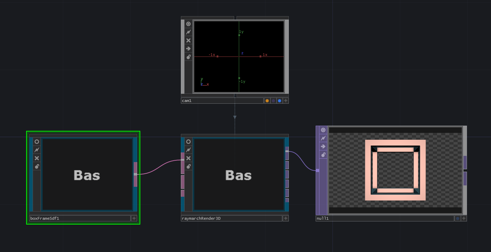

# RayTK

RayTK is a library of TouchDesigner components that construct raymarching shaders (and other types of shaders) using networks of COMPs the TouchDesigner network editor.

RayTK consists of a set of operator (ROP) components, and a set of tools for working with them.

## Getting Started

### Download the Library

The first step to using RayTK is to download the latest tox file, from the [repository](https://github.com/t3kt/raytk/releases).

Note that there are many of files in the repository itself, but these are only needed for development purposes. If you only want to *use* the library rather than *modify* it, use the release tox file.

### Load the Library

Drag the tox file into your project. It's a good idea to put it in the *root* network (`/` rather than `/project1`), but not strictly necessary.

### Creating a Network

To create your first ROP, use the keyboard shortcut `alt + r` to open up the editor tools popup. It will show a list of available ROPs, organized into categories. You can search by typing a name. This popup is like the main TouchDesigner "OP Create Dialog" (using `tab`), but it shows the available ROPs rather than the standard TouchDesigner OPs.

1. Choose a `boxFrameSdf`, and a new COMP will be created in the network editor.
1. Create a `raymarchRender3d` and connect its input to the output of your `boxFrameSdf`.
1. Create a `Camera COMP`, and drag it onto the `raymarchRender3d`'s `Camera` parameter.
1. Connect a `Null TOP` to the first output of `raymarchRender3d`.
1. Play around with the parameters of the `boxFrameSdf`.

You've just created your first RayTK network!

The `boxFrameSdf` is an `SDF` operator, which is how you define geometry. It's equivalent to `SOP`s like `Sphere`, `Box`, etc.

## How RayTK works

### Output `ROP`s

An `SDF` on its own is just a chunk of data. It needs to be sent to a special "Output" `ROP`, such as `raymarchRender3d`. These special `ROPs` take in one or more `ROP` inputs, construct a shader based on those inputs, and runs it in a `GLSL TOP`, to produce various types of image outputs. As the name suggests, `raymarchRender3d` uses the `ROP` network to build a raymarching shader, producing a rendered view of your scene, from some sort of camera. It's analagous to a `Render TOP`, which takes in some `Geometry COMP`s and renders them to an image.

### Regular `ROP`s and Definition Tables

Each regular (non-output) `ROP` produces a single output, a `DAT` containing a data table describing that `ROP` and all of its inputs. They are known as "Definitions". Unless you are developing the core of the RayTK library itself, you will never need to deal directly with the contents of the definitions. They should be treated as an opaque data type. They're just the "thing" that comes out of a `ROP`.

